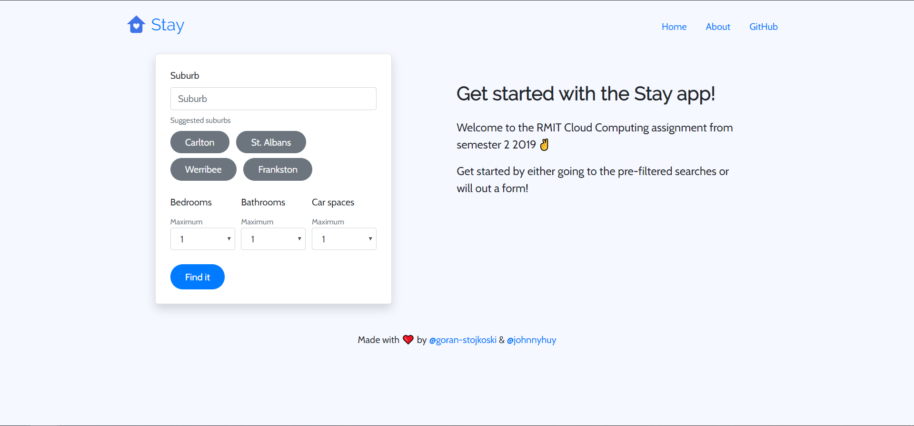
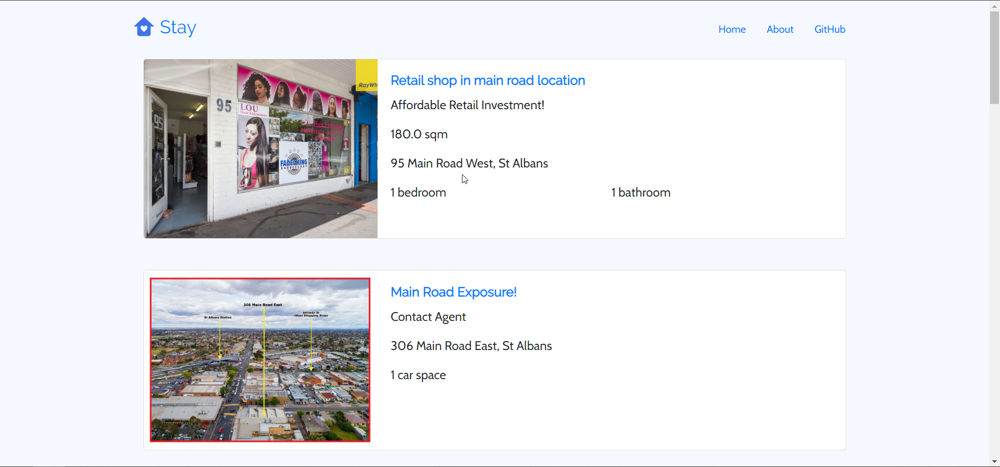
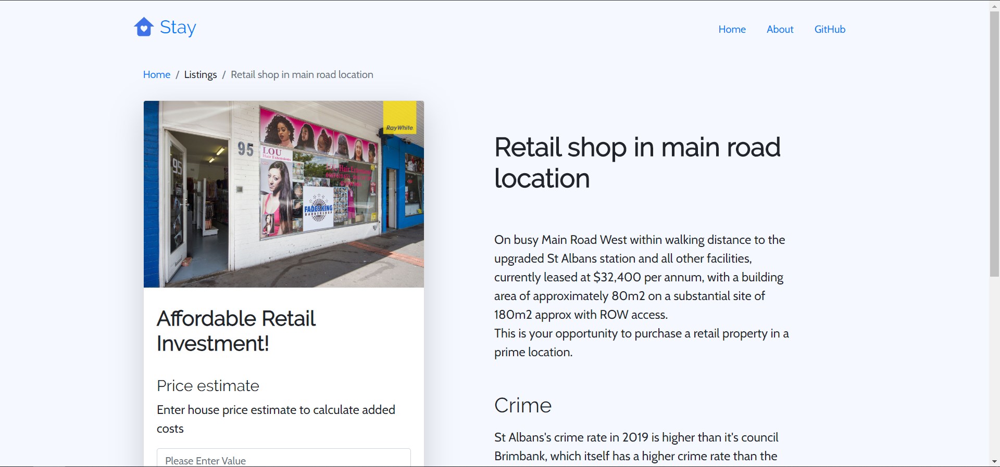
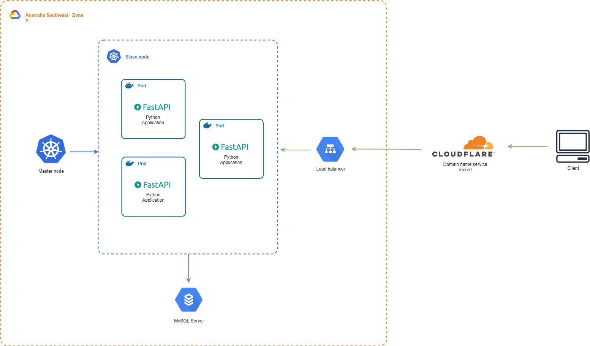
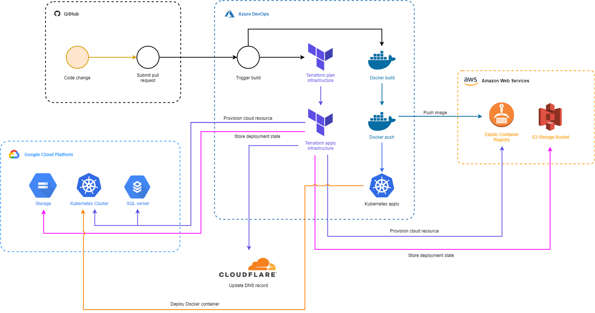
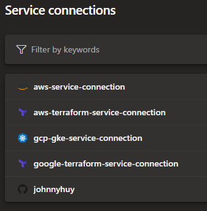

# Cloud Computing Assignment Two

Real estate application using cloud resources

- [Cloud Computing Assignment Two](#cloud-computing-assignment-two)
  - [Project name: Stay App](#project-name-stay-app)
    - [Distributed model for the application](#distributed-model-for-the-application)
    - [Tools and techniques](#tools-and-techniques)
    - [Data persistence](#data-persistence)
    - [User interface](#user-interface)
    - [Layout](#layout)
  - [Application Development](#application-development)
    - [Startup Flask app](#startup-flask-app)
    - [How to stop Flask app](#how-to-stop-flask-app)
  - [Infrastructure Development](#infrastructure-development)
    - [Getting started with pipelines in Azure DevOps](#getting-started-with-pipelines-in-azure-devops)
      - [Creating the project](#creating-the-project)
      - [Creating the pipelines](#creating-the-pipelines)
      - [Get the application pipeline deploying applications](#get-the-application-pipeline-deploying-applications)
    - [How to run a deployment from you local machine](#how-to-run-a-deployment-from-you-local-machine)

## Project name: Stay App

Create a real estate helper tool by developing a simple web application that can fetch real estate data from the Domain real estate public API that can be displayed on Google maps. User session can be used to store saved locations and a cache can also be used to store external API data.







### Distributed model for the application

- Cluster computing
- Deploy PHP application -> fetches API data and potentially user session
- Use AWS EKS -> container orchestration

### Tools and techniques

- Google Cloud Platform -> cloud provider
- AWS -> secondary cloud provider
- GitHub -> code repository
- Azure DevOps -> DevOps pipelines
- Terraform -> cloud deployment tool

### Data persistence

- MySQL server -> data persistence
- GitLab container registry or AWS ECR -> Docker image storage

### User interface

- Python Flask application

### Layout

This is the application layout of the Python application in a Kubernetes cluster.



This is the continuous integration and delivery process to get it into the cloud.



## Application Development

We've provided a easy local development experience by using [Docker](https://www.docker.com/) to produce a consistent environment on any development system.

### Startup Flask app

Run the following command at the project root. We're using [Docker Compose](https://docs.docker.com/compose/), a multi-container tool to run containers based on a single YAML config.

```bash
# Run the container from the Docker Compose config detached (-d)
docker-compose up -d
```

### How to stop Flask app

Once you're done for the day, you can run the following command to stop all containers from that config. Make sure you're in the root project directory.

```bash
# Remove all running containers
docker-compose down
```

## Infrastructure Development

We're currently using [Terraform](https://www.terraform.io/) to deploy our infrastructure stored as code. Using a pipeline from Azure DevOps we can leverage a code change to deploy infrastructure with full automation.

Here's a list of infrastructure files and folders involved:

- `terraform/` - templates used to deploy cloud resources
- `pipelines/infrastructure.yml` - the infrastructure deployment pipeline for Azure DevOps

Here are the prerequisites to start work on it:

- [Terraform CLI](https://learn.hashicorp.com/terraform/getting-started/install.html)
- [AWS CLI](https://docs.aws.amazon.com/cli/latest/userguide/cli-chap-install.html)
- [GCloud SDK](https://cloud.google.com/sdk/install)

[Terraform Getting started - AWS](https://learn.hashicorp.com/terraform/getting-started/install)

### Getting started with pipelines in Azure DevOps

This section will cover the setup in Azure DevOps

#### Creating the project

TODO

#### Creating the pipelines

TODO

#### Get the application pipeline deploying applications

Pipelines are set in the code repository under `pipelines/application.yml` and `pipelines/infrastructure.yml` to allow Azure DevOps to run against their build agents.


We have installed the following Azure DevOps extensions under the organization:

- [AWS Tools for Microsoft Visual Studio Team Services by Amazon Web Services](https://marketplace.visualstudio.com/items?itemName=AmazonWebServices.aws-vsts-tools)
- [Terraform by Microsoft DevLabs](https://marketplace.visualstudio.com/items?itemName=ms-devlabs.custom-terraform-tasks)

The infrastructure pipeline is the **initial** pipeline used to create the *underlying cloud resources* for the **application pipeline** to deploy on on top. We needed to setup individual service connections in order to allow the pipelines in Azure DevOps talk to cloud providers.



Service connection list required for the infrastructure and application pipelines:

- aws-service-connection: AWS extension
- aws-terraform-service-connection: Terraform extension
- gcp-gke-service-connection: Kubernetes extension
- google-terraform-service-connection: Terraform extension

Run the infrastructure pipeline first and get access into the newly created Kubernetes cluster by running the following commands.

```bash
# Login to GCloud
gcloud auth login

# Get the cluster credentials, replace the brackets accordingly
gcloud container clusters get-credentials [GKE cluster name] --region [region of the cluster]
```

We need a service account for the Azure DevOps service connection to allow the application pipeline to talk to the cluster.

```bash
# Deploy the service account based on a config in this repository
# Be sure you're in the root directory of this repository
kubectl apply ./init

# Get the secret value of the service account
kubectl describe sa 'stayapp-serviceaccount'

# Use the the first token name from the previous output of the command
# Copy the output of this command
kubectl get secret -o yaml [service account token name]
```

Create a service connection in the Azure DevOps "Settings > Service connections" and choose the "Kubernetes" option.


Should be greeted with a menu to create a Kubernetes service connection.

- **Connection name:** gcp-service-connection
- **Service URL:** "get the cluster IP from GCloud Console"
- **Secret:** "use the output of the `kubectl get secret`"

Now we can use both the infrastructure and application pipelines to deploy our cloud resources and application on top.

### How to run a deployment from you local machine

Sometimes we don't need to leverage Azure DevOps pipelines to deploy things into the cloud. Though this comes with the trade-off of more manual steps including getting the cloud provider credentials for Terraform to use.

Here's some quick start commands to deploy the resources from your local machine. Change directory to either `terraform/gcp` or `terraform/aws` and run the following command to deploy resources. Be sure to have relevant Cloud credentials installed on the local machine before continuing.

```bash
# Initialise Terraform modules in the folder
terraform init

# Dry run deploy the resource
terraform plan

# Deploy the resources
terraform apply
```
